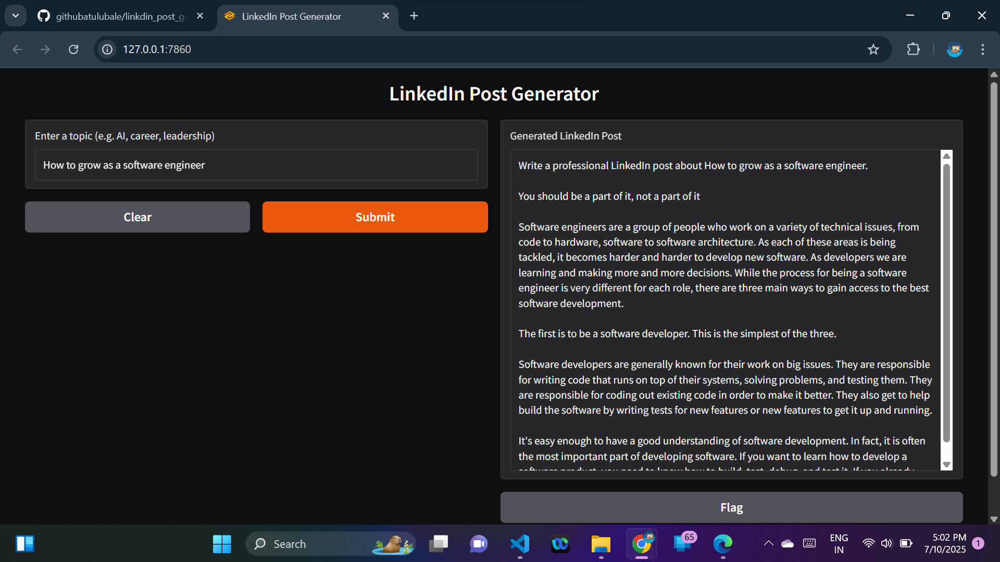

 
# LinkedIn Post Generator (LLM)

This project uses GPT-2 (open-source LLM) to generate human-like LinkedIn posts across themes like AI, career growth, leadership Runs locally with no external APIs.

## Setup

1. Clone the repo:
```bash
git clone https://github.com/yourname/linkedin_post_generator.git
cd linkedin_post_generator
```

2. Install dependencies:
```bash
pip install -r requirements.txt
```

3. Fine-tune the model:
```bash
python fine_tune.py
```

4. Run the app:
```bash
python app.py
```

Visit `http://localhost:7860` in your browser.

## 📁 Files

- `app.py` – Gradio UI
- `generate_post.py` – GPT-2 model + logic
- `linkedin_posts.txt` – Fine-tuning examples
- `fine_tune.py` – Script to fine-tune GPT-2

 
=======
## 🖼️ Sample Output

Here’s an example of a LinkedIn post generated by the model:



 
